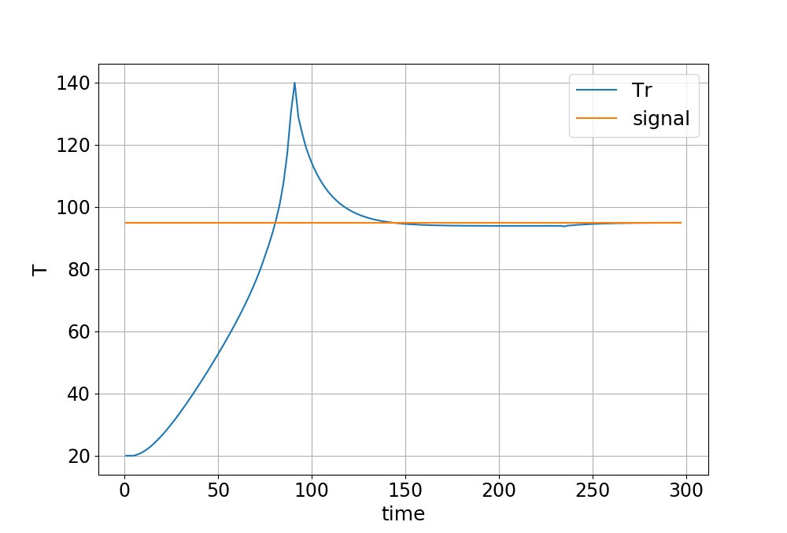

### Cyber-Physical Systems exam Repository

Studying the behavior of a Chemical Batch Reactor.

In these files you can find:

* !mplementation of a PID controller1

<figure>
  
  <figcaption>
      Reactor temperature following a varying signal
  </figcaption>
</figure>

* Expression and evaluation of Signal Temporal Logic requirements<2/sup> over the reactor temperature variable

* Control the of the system with Reinforcement Learning - SARSA evaluation policy to follow a constant signal

Result:

<figure>
  
  <figcaption>
      Reactor temperature policy obtained from SARSA.
  </figcaption>
</figure>

### References:

1) A. Shamekh, T. Hussein, and A. Altowati, "Design of Standard PID Controller for Exothermic Batch Process Simulation", 2013 European Modelling Symposium.

2) Temporal Logic package: https://github.com/mvcisback/py-metric-temporal-logic
