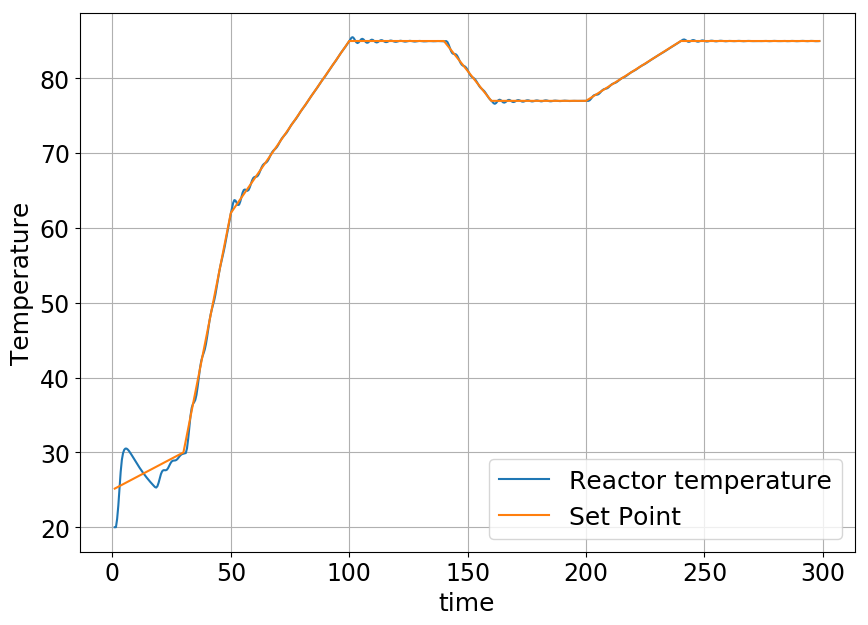
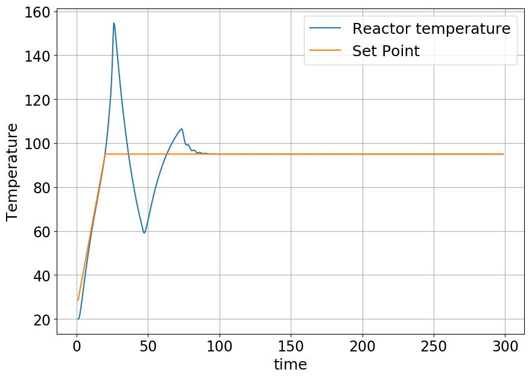

### Cyber-Physical Systems exam Repository

<figure>
  
  <figcaption>
      Reactor temperature signal and output for signal 1
  </figcaption>
</figure>

<figure>
  
  <figcaption>
      Reactor temperature signal and output for signal 2
  </figcaption>
</figure>
